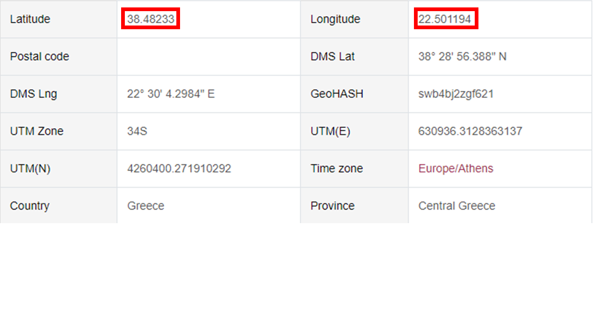
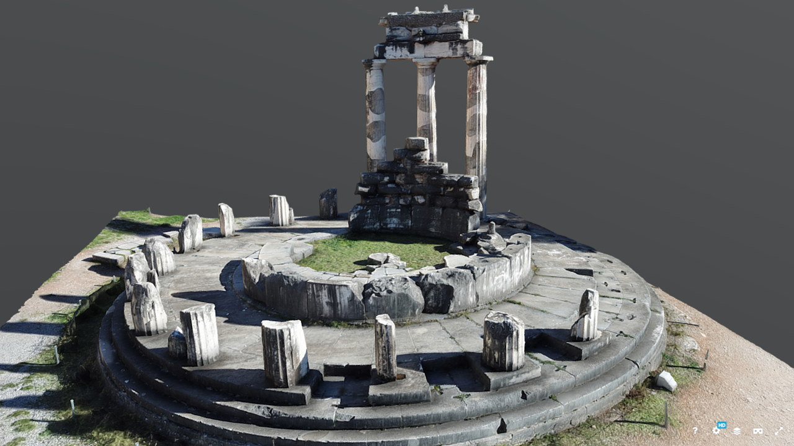
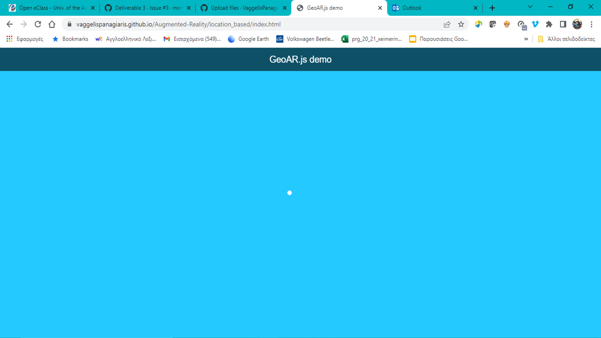
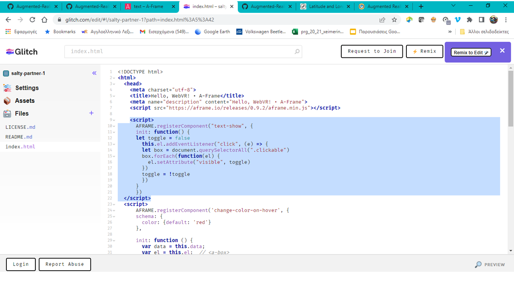

# Lesson: Interaction Design

### First and Last Name: Evangelos Panagiaris Maleas
### University Registration Number: dpsd19090
### GitHub Personal Profile: [VaggelisPanagiaris](https://github.com/VaggelisPanagiaris)
### Augmented Reality Personal Repository: https://vaggelispanagiaris.github.io/Augmented-Reality/

# Introduction

# Summary

# 1st Deliverable
 1. Αρχικά ξεκίνησα με την εισαγωγή των υπόλοιπων αντικειμένων στην σκηνή όταν η κάμερα αναγνωρίζει το "hiro" (σφαίρα & κύλινδρος), για τα οπόια βρήκα τον κώδικα στο [A-Frame School](https://aframe.io/aframe-school/#/4/1) > [Glitch](https://glitch.com/~aframe-school-position) .
  2. Εκανα τις αλλαγές όσων αφορά την θέση, το μέγεθος και τα χρώματα, τους κωδικούς των οποίων πήρα απο το [HTML COLOR CODES](https://htmlcolorcodes.com/) . 
 3. Στη συνέχεια απο το [A-Frame particle system component](https://www.npmjs.com/package/aframe-particle-system-component) βρήκα τον κώδικα για να προσθέσω το χιόνι στην σκηνή και με τις κατάλληλες αλλαγές.
 4. Με συμπληρωματικό κώδικα απο το [A-Frame particle system component](https://www.npmjs.com/package/aframe-speech-command-component) πρόσθεσα την λειτουργία του speech command, ώστε με την φωνητική εντολή "Start" να ξεκινάει να χιονίζει στην σκηνή, ενώ με την φωνητική εντολή "Stop" να σταματάει.
 5. Για να κάνω πιο πυκνό το χιόνι, χρησιμοποίησα κώδικα απο το [A-Frame particle system component](https://aframe.io/aframe-school/#/8) > [Glitch](https://glitch.com/~aframe-school-registry)..

Τέλος έχω κάνει κάποιες αισθητικές αλλαγές στην αρχική σελίδα [index.html](https://vaggelispanagiaris.github.io/Augmented-Reality/), με τις επιλογές "Marker_Based","Location_Based","Syros_Location_Based". Έχω χρησιμοποιήσει γνώσεις και ιδέες για την μορφοποίηση της απο την εργασία στο μάθημα της Πληροφορικής, του 1ου εξαμήνου του προγράμματος σπουδών του Τμήματος Μηχανικών Σχεδίασης Προϊόντων & Συστημάτων του Πανεπιστημίου Αγαίου. Για τα 'buttons' χρησιμοποίησα κώδικα απο το [W3Schools](https://www.w3schools.com/howto/howto_css_animate_buttons.asp). Τους κωδικούς των χρωμάτων τους πήρα απο το [HTML COLOR CODES](https://htmlcolorcodes.com/). 

# 2nd Deliverable
  ***Για το 1ο ζητούμενο*** του 2ου παραδοτέο δημιούργησα τα markers που χρειαζόμουν. Το marker για το dpsd μου το έφτιαξα στο Power Point της Microsoft και στη συνέχεια αφου κατέβασα τις εικόνες απο τον φάκελο assets (Hydrogen, Oxygen), χρησιμοποίησα την ιστοσελίδα [AR.js Marker Training](https://jeromeetienne.github.io/AR.js/three.js/examples/marker-training/examples/generator.html) για την δημιουργία των markers(.patt αρχείο και png image).
 Στη συνέχεια ανέβασα την εικόνα που ήθελα να εμφανίζεται όταν η κάμερα σκανάρει το dpsd marker μου, αφού την έκανα με transparent φόντο και πρόσθεσα να εμφανίζεται το κείμενο με το ονομά μου. Για το πρώτο ζητούμενο, για να κάνει display μια εικόνα μου όταν η κάμερα αναγνωρίζει το dpsd marker χρησιμοποίησα κώδικα απο το [A-Frame_a-image](https://aframe.io/docs/1.3.0/primitives/a-image.html#example) και για το Όνομα, που το έκανα με *text*, απο το [A-Frame_a-text](https://aframe.io/docs/1.3.0/primitives/a-text.html#example). Έπειτα άλλαξα το font απο το [A-Frame_text](https://aframe.io/docs/1.3.0/components/text.html#fonts2_dejavu) > [Glitch](https://glitch.com/~aframe-text-fonts-demo). 
  ***Για το 2ο ζητούμενο*** δημιούργησα στο blender τα animation για το Οξυγόνο και το Υδρογόνο με transparent backround και τα ανέβασα σε μορφή mp4. Επιπλέον έχω συντάξει μια εντολή ώστε όταν διαβάζει η κάμερα ένα από τα 2 markers Oxygen / Hydrogen να εμφανίζεται η εικόνα του Οξυγόνου και του Υδρογόνου πίσω από το εκάστοτε animation.
 ***Για το 3ο ζητούμενο***. Πήρα τον κώδικα για την [απόσταση των δύο markers](https://stackoverflow.com/questions/61239107/how-to-get-marker-position-x-y-ar-js). Βρήκα από το [Α-frame](https://aframe.io/docs/1.3.0/core/entity.html#properties) και από [εδώ](https://stackoverflow.com/questions/67578125/a-frame-show-gltf-model-if-variable-has-a-certain-value), πως να "καλώ" τις entities και να διαχειριστώ το "visibility". Και τέλος τοποθέτησα το script, στην [σωστή θέση](https://aframe.io/docs/0.8.0/introduction/writing-a-component.html). Δοκιμαζοντάς το αρχικά στον Localhost μου "χάλασε" όλο το κώδικα και σταμάτησε να διαβάζει τα υπόλοιπα markers.Όσο και αν έψαξα στο διαδίκτυο για το πως να το λύσω το πρόβλημα που δημιουργήθηκε, δεν κατάφερα τίποτα... Οπότε και δεν το πρόσθεσα ποτέ αυτό το βήμα στο GitHub για να μην χαλάσει και εδώ ο κώδικας μου.
 ***Τέλος να αναφέρω ότι αντιμετώπιζα συνεχώς πρόβλημα με το GitHub και ενίοτε με τον Localhost! Στην αρχή δεν αναγνώριζε το GitHub τα markers που είχα φτιάξει και τα αναγνώριζε μονάχα ο Localhost. Κατα την διάρκεια της εργασίας σταμάτησε και ο Localhost να αναγνωρίζει τα markers μου και επρεπε να ανοίγω την σελίδα του GitHub από το κινητό και να σκανάρω το marker από την κάμερα του κινητού μου. Το αντιμετώπισαν κι' άλλοι συνάδελφοι αυτό το πρόβλημα χωρίς κανένας μας να μπορεί να ερμηνέυσει την αιτία. Επιπλέον στην αρχή αναγκάστηκα να αλλάξω το φόντο του dpsd marker μου σε γκρι για να το αναγνωρίζει καλύτερα (Γιαυτό και έχω ανεβάσει 2 αρχεια με το dpsd 19090, όμως το "dpsd grey" είναι αυτό που διαβάζει η κάμερα).***
# 3rd Deliverable 
  ***Για το 1ο ζητούμενο*** Έψαξα και κατέβασα τον [Θόλο των Δελφών](https://el.wikipedia.org/wiki/%CE%98%CF%8C%CE%BB%CE%BF%CF%82_%CF%84%CF%89%CE%BD_%CE%94%CE%B5%CE%BB%CF%86%CF%8E%CE%BD) σε gltf αρχείο από το [sketchfab](https://sketchfab.com/search?q=tholos+delphi&type=models) και βρήκα τις συντεταγμένες του μνημείου από το Google.

 Έπειτα πρόσθεσα το gltf αρχείο που είχα προηγουμένος κατεβάσει.

  Αντιμετώπισα όμως πρόβλημα, στην αρχή ανέβασα στα assets μόνο το gltf αρχείο και δεν εμφανιζόταν στην οθόνη. Πάτησα ctr+alt+I και μου εμφάνησε ένα πλαίσιο. Στη συνέχεια ανέβασα και τα υπόλοιπα αρχεία που κατέβασα και συνόδευαν το 3d object και για κάποιο λόγο σταμάτησε να ανοίγει η κάμερα και η οθόνη εμφάνιζε το παρακάτω:

  ***Για το 2ο ζητούμενο*** Πρόσθεσα στον κώδικα μου με την βοήθεια [αυτόυ του παραδείγματος](https://glitch.com/edit/#!/salty-partner-1?path=index.html%3A11%3A21), έτσι ώστε όταν κάνετε κλικ στο animation, να εμφανίζεται το text.

# Conclusions

# Sources
- Deliverable 1 | [A-Frame School](https://aframe.io/aframe-school/#/4/1 | [Glitch](https://glitch.com/~aframe-school-position) | [HTML COLOR CODES](https://htmlcolorcodes.com/) | [A-Frame particle system component](https://www.npmjs.com/package/aframe-particle-system-component) | [Snow](https://glitch.com/~aframe-school-registry) 
- Deliverable 2 | [AR.js Marker Training](https://jeromeetienne.github.io/AR.js/three.js/examples/marker-training/examples/generator.html) | [A-Frame_a-image](https://aframe.io/docs/1.3.0/primitives/a-image.html#example) | A-Frame_a-text](https://aframe.io/docs/1.3.0/primitives/a-text.html#example) | [απόσταση των δύο markers](https://stackoverflow.com/questions/61239107/how-to-get-marker-position-x-y-ar-js)| 
- Deliverable 3 | [Θόλο των Δελφών](https://el.wikipedia.org/wiki/%CE%98%CF%8C%CE%BB%CE%BF%CF%82_%CF%84%CF%89%CE%BD_%CE%94%CE%B5%CE%BB%CF%86%CF%8E%CE%BD) | [sketchfab](https://sketchfab.com/search?q=tholos+delphi&type=models) |  
